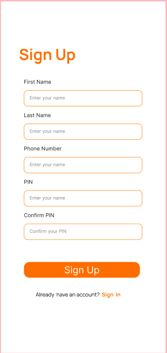
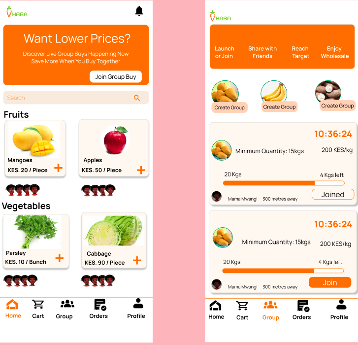
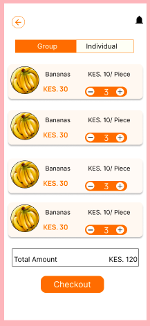
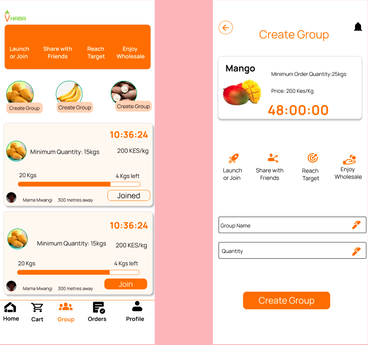
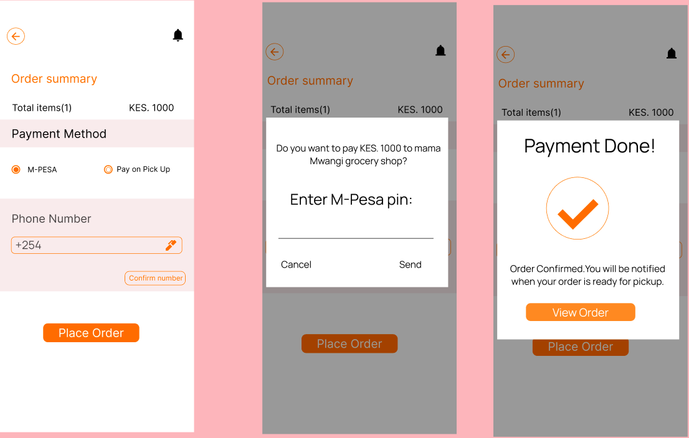
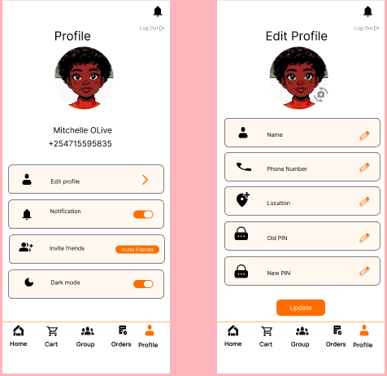

# Customer Guide (Gorzo Mobile App)

Welcome to the Gorzo Customer Guide. This guide will help you make the most out of the Gorzo mobile app to conveniently shop for groceries, join group buys, and complete payments.

## 1. Getting Started

- Download the Gorzo app from your device’s app store:
- Open the app and tap **Sign Up** to create your account.
- Verify your account as prompted.
- Log in to access the full features of the app.

## 2. Browsing and Searching Products

- Use the **Browse** tab to view products grouped by categories or vendors.
- Use the search bar to find specific items quickly.
- Tap on a product to view detailed information including price, description, and vendor details.
- Add products to your cart for either a one-time purchase or subscription.

## 3. Managing Your Cart

- After selecting products, review your cart by tapping the cart icon.
- Adjust product quantities or remove items as needed.
- Select whether your purchase is one-time or part of a subscription (if available).
- Proceed to checkout when ready.

## 4. Joining or Creating Group Orders

- Navigate to the **Groups** section from the main menu.
- Browse **Live Group Orders Near You** to find existing groups to join.
- To join a group:
  - Select the group you want to join.
  - Add the required products to your portion of the group order.
  - Confirm your participation before the group deadline (typically 8-48 hours).
- To create a group:
  - Tap **Create Group**.
  - Set the order details and invite others to join.
- Once the group meets the minimum order threshold, it will close automatically and payment requests will be sent.

## 5. Payment Process

- Complete your payment using the integrated mobile money payment system (M-Pesa).
- Payment requests will be sent to you via mobile money STK Push.
- Ensure timely payment to secure your order.
- After payment confirmation, pick up your groceries from the vendor location as instructed.

## 6. Managing Your Account

- Update personal information, contact details, and notification preferences in the **Profile** section.
- Track your order history to review past purchases.

## 7. Tips for a Great Shopping Experience

- Join groups close to your location to enjoy timely delivery or pickup.
- Check deadlines carefully to avoid missing group order closures.
- Keep your mobile money account active and ready for smooth payments.
- Reach out to support if you face any issues with ordering or payment.

## 8. Need Help?

- Visit the [FAQs](faqs.md) for answers to common questions.

For detailed guides, please proceed to the [Getting Started](getting-started.md) section.
Enjoy shopping on Gorzo — helping you get fresh groceries conveniently!

