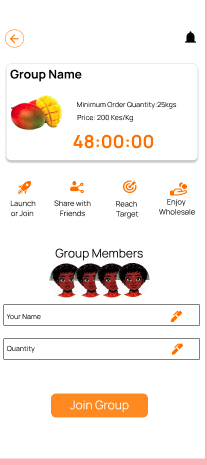

# Group Buying System

The Gorzo platform offers a **Group Buying** feature that enables customers to join or create groups to place bulk orders with Mama Mboga vendors. This approach helps you save money, reduce waste, and strengthen local buying communities.

## How Group Buying Works

### For Customers

1. **Discover Groups Near You**  
   - Browse the **Live Group Orders Near You** section in the app to find active groups linked to vendors within your local area.
   - Groups are location-based and typically include participants living within approximately 300 meters for convenience.

2. **Joining a Group**  
   - Select an active group order you want to join.
   - Add your desired products to your portion of the group order.
   - Confirm your participation before the group’s joining deadline (usually between 8 to 48 hours).

   

3. **Creating a Group**  
   - If you don’t find a suitable group, you can create your own.
   - Set the details such as order items, minimum order quantity, and invite others to join.

4. **Group Order Closure**  
   - When the group reaches the minimum quantity requirement, the group automatically closes.
   - If the minimum order is not met by the deadline, the group is dissolved and no orders are placed.

5. **Payment**  
   - Payment requests are sent to all group members via mobile money (M-Pesa STK Push).
   - Complete your payment promptly to secure your order.

6. **Order Fulfillment**  
   - Mama Mboga vendors receive the consolidated order list.
   - Customers pick up their orders from the vendor as arranged.

### For Vendors
- Monitor active group orders through the vendor PWA dashboard.
- Prepare products for group orders once minimum thresholds are met.
- Track payment statuses and coordinate order pickup logistics with customers.

## Benefits of Group Buying

- **Cost Savings:** Bulk orders often qualify for discounts.
- **Reduced Waste:** More accurate inventory orders reduce spoilage.
- **Community Engagement:** Strengthens community ties by shopping together.
- **Convenience:** Streamlines the ordering and payment process.

## Important Notes

- Group orders are strictly local to ensure timely pickup and product freshness.
- Groups automatically close once the order meets the required quantity.
- Customers who miss payment deadlines risk losing their place in the group order.