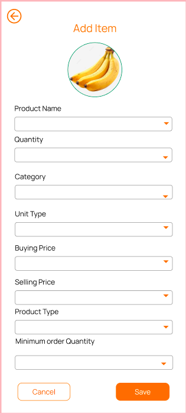
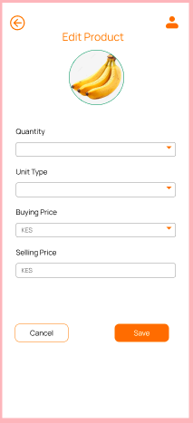

# Vendor Guide (Mama Mboga PWA)

Welcome to the Gorzo Vendor Guide. 
This guide will help you, as a Mama Mboga vendor, to effectively use the Progressive Web App (PWA) to manage your inventory, process orders, view sales performance, and handle payments.

## 1. Accessing the Vendor Portal

- Download Haba application on your phone store.
- Log in using your registered username and password.
- If you don’t have an account, use the **Register** option to sign up.

    

## 2. Managing Your Inventory

Keeping your inventory updated ensures customers see the right products available for purchase.

### Adding New Products

1. Navigate to the **Inventory** section from the dashboard.
2. Click **Add Product**.
3. Fill in product details, including:
   - Product name
   - Description
   - Price
   - Quantity in stock
4. Save your product to add it to your inventory.

### Updating Existing Products

1. In the **Inventory** section, select the product you want to update.
2. Adjust price, quantity, or description as needed.
3. Save your changes to ensure the latest information is shown to customers.

## 3. Processing and Tracking Orders

### Group Orders

- View active group orders on your dashboard.
- Once a group order meets the minimum quantity, it will close automatically and payment requests will be sent to customers.
- Prepare the products and organize pickup or delivery as applicable.

### One-time Orders

- Monitor and process individual orders as they come in.
- Confirm the order and update its status (e.g., prepared, ready for pickup).

## 4. Handling Payments

- Gorzo integrates with M-Pesa mobile money for seamless payment processing.
- Payments are generally requested via STK Push directly to customers.
- Check the **Payments** section to confirm received payments.
- Follow up on any orders with pending or failed payments.

## 5. Tips for Success

- Regularly update your inventory to avoid disappointing customers.
- Monitor sales reports to identify and promote popular products.
- Use group buying features to encourage bulk orders and increase sales.
- Respond promptly to order notifications to maintain good customer relationships.

## 6. Support and Help

- Visit the [FAQs](faqs.md) for common questions and troubleshooting tips.

Thank you for being part of the Gorzo platform and helping bring modern grocery shopping solutions to your community!

